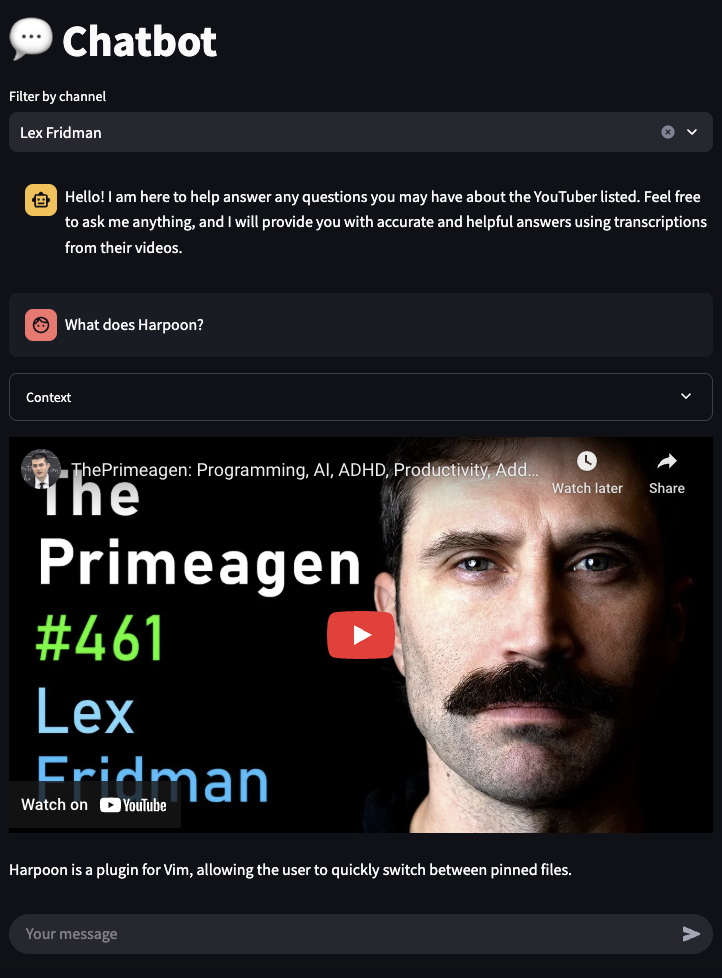
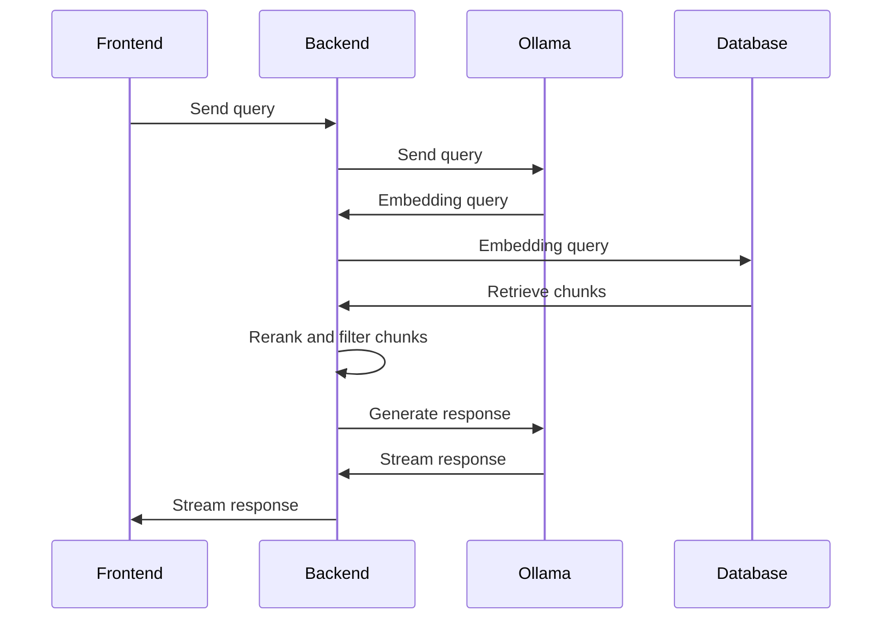

# RAGTube

RAGTube is a Retrieval Augmented Generation (RAG) application that lets you query transcriptions from your favorite YouTubers. It retrieves the most relevant transcription chunks for your query and provides them as context to a large language model (LLM) to generate responses.

Showcase https://ragtube.dgarridoa.xyz/


# Arquitecture

• Database & Vector Storage: A PostgreSQL database is employed to persist data including channels, videos, transcriptions, and chunks. It utilizes the pgvector extension to enable vector similarity search, enabling exact and approximate nearest neighbgor search. To interact with the database the SQLModel ORM is used.

• Ollama: To serve as a local embedding and language model. It generates embeddings for text (transcriptions chunks and queries) and for generating responses based on the query and its corresponding contextual information provided by the retriever.

• Backend: Built using FastAPI, the backend layer exposes endpoints for readiness checks, listing channels, and handling RAG queries. This API communicates with both the database (to fetch data), and Ollama (to generate embeddings and chat completions). The RAG endpoint retrieve most relevant chunks, rerank them using FlasRank and filter them and finally pass them to the chat model to generate responses.

• Frontend: The application’s user interface is built with Streamlit, which interacts with the FastAPI backend. It provides users with a way to ask questions and view search results and generated responses.

• CLI and Database Tools: A Typer-based command line interface is provided for database population. It downloads transcriptions, split them into chunks, computes their embeddings and create the HNSW index if does not exist.

• Containerization & Deployment: Docker Compose is used to orchestrate the entire application stack including the PostgreSQL database, Ollama (for model serving), FastAPI (banckend), Streamlit (frontend), and additional services such as Watchtower for automated rolling releases and Traefik serving as a reverse proxy with SSL handling.



# Install project

First, install [uv](https://docs.astral.sh/uv/) a Python package and project manager.
```bash
curl -LsSf https://astral.sh/uv/install.sh | sh
```

Then install Python 3.11 and pin it.
```bash
uv python install 3.11
uv pin 3.11
```

Finally, install the project.
```bash
uv sync --alll-extras
```

# Parameters

Application parameters are defined in the `params.yaml` file.

- `channel_id`: List of string, the channel IDs to download transcriptions from.
- `language`: String, the language of the transcriptions.
- `request_timeout`: Integer, timeout in seconds for HTTP requests to retrieve list of videos of a channel and get transcriptions from a video.
- `chunk_size`: Integer, the maximum number of words in a chunk, used to split transcriptions in chunks.
- `chunk_overlap`: Integer, the number of words to overlap between chunks.
- `embedding_size`: Integer. This value represents the dimensionality of the embeddings provided by the chosen model and determines the size of the embedding array column in the `chunk` table.
- `embedding_model_name`: String, the name of the model used to compute the embeddings, it must be a model supported by [`ollama`](https://ollama.com/search?c=embedding).
- `embedding_num_ctx`: String, size of the context window used to generate the next token, must not be greater than the maximum context window size of the model.
- `index_hnsm_m`: Integer, `m` parameter of the HNSW index.
- `index_hnsw_ef_construction`: Integer, `ef_construction` parameter of the HNSW index.
- `index_hnsw_ef_search`: Integer, `ef_search` parameter of the HNSW index.
- `index_vector_ops`: String, the name of the vector operations to use, it must be a vector operation supported by `pgvector`.
- `results_to_retrieve`: Integer, the number of approximate nearest neighbors to retrieve from the HNSW index.
- `rerank_model_name`: String, the name of the model used to rerank the results retrieve by the HNSW index, it must be a model supported by [`flashrank`](https://github.com/PrithivirajDamodaran/FlashRank).
- `rerank_score_threshold`: Integer, the minimum rerank score required for a result from the HNSW index to be presented to the user.
- `chat_model_name`: String, the name of the model used to generate responses based on a provided question and its corresponding retrieved context. The model must be one of those supported by [`ollama`](https://ollama.com/search?c=chat).
- `chat_temperature`: Float, the temperature used to sample tokens from the chat model.
- `chat_max_tokens`: Integer, the maximum number of tokens to generate from the chat model.

# Environment file

Ensure you have a `.env` file in the project's root directory. Obtain a YouTube API key— for more details, visit [this guide](https://developers.google.com/youtube/v3/getting-started). Optionally, if you're running this in a CI/CD pipeline or on a cloud provider prone to bot challenges, you might need to set an HTTP proxy. The file should look like the following:

```bash
YOUTUBE_API_KEY=<KEY>
# HTTPS_PROXY=http://<user>:<password>@<host>:<port>
DB_USER=postgres
DB_PASSWORD=postgres
DB_HOST=postgres
DB_PORT=5432
DB_NAME=postgres
API_HOST=api
API_PORT=5000
```

# Database

To start a PostgreSQL container, with pgvector extension for vector store capabilities, run the following command:

```bash
docker run \
    --name test-postgres \
    -p 5432:5432 \
    -d \
    -e POSTGRES_HOST_AUTH_METHOD=trust \
    pgvector/pgvector:pg16`
```

References:
- [pgvector repository](https://github.com/pgvector/pgvector)
- [pgvetor python SDK](https://github.com/pgvector/pgvector-python)

# Run unit tests

Create `.env-test` file as `.env` file mentioned in the previous section. Then you should run the following command:

```bash
uv run pytest
```

Note that you should have the database running.

# Ollama

Install [ollama](https://ollama.com/download), a tool that makes it easy to run open-source LLMs locally.

Execute `run-ollama.sh` to start a server, which exposes a REST API for interact with downloaded models. It then downloads the models specified by the `chat_model_name` and `embedding_model_name` fields in the `params.yaml` file. For example:

```bash
ollama serve
ollama pull llama3.2:3b
ollama pull bge-large
```

## Use generate endpoint
```bash
curl http://host.docker.internal:11434/api/generate -d '{
  "model": "llama3.2:3b",
  "prompt": "Why is the sky blue?",
  "stream": false
}'
```

## Use embed endpoint
```bash
curl http://localhost:11434/api/embed -d '{
  "model": "bge-large",
  "input": "Llamas are members of the camelid family"
}'
```

# Database population

To populate the database, set the `channel_id` field in the `params.yaml` file with the channels for which you wish to download transcriptions. Then run a Typer based CLI through the following command:

```bash
uv run python -m ragtube.cli
```

This will create the `channel`, `video`, `caption`, and `chunk` tables. Their schemas are defined in the `models` module. It lists videos from a channel, downloads transcriptions from missing videos, chunks these transcriptions into smaller pieces, and computes their embeddings. Finally, an HNSW index is created if it does not already exist.

# Backend

To start the backend run the following command:

```bash
uv run uvicorn ragtube.api:app --host 0.0.0.0 --port 5000 --log-config log_config.yaml
```
The Open API documentation can be found at [http:localhost:5000/docs](http:localhost:5000/docs). It have three endpoints:
- `/readiness`: to verify the readiness of the API.
- `/channel`: to get a list of channels.
- `/rag`: to ask a question (`input`) to the RAG. Optionally, you can perform deep search in a specific channel suplying its `channel_id`.

```bash
curl http://localhost:5000/rag?input=What%20does%20Harpoon%3F&channel_id=UCSHZKyawb77ixDdsGog4iWA
```

# Frontend

To start the frontend run the following command:

```bash
uv run python -m streamlit run ragtube/ui.py
```

You can now access the application at [http://localhost:8501](http://localhost:8501).

# CI/CD

The pull request will trigger the pipeline detailed in the `.github/workflows/onpr.yaml` file.  These steps are: Starts a PostgreSQL container using Docker, checkout the branch from the repository, create the `.env-test` file, set up Python 3.11, install uv, install project dependencies, run pre-commit checks, execute unit tests, and build and publish both the `ragtube` and `ollama` Docker images.

As prerequisites, you should have the following [Github Secrets](https://docs.github.com/en/actions/security-for-github-actions/security-guides/using-secrets-in-github-actions) set up in your repository:
- `YOUTUBE_API_KEY`
- `HTTPS_PROXY`
- `DOCKER_HUB_USERNAME`
- `DOCKER_HUB_PASSWORD`

Docker images:
- https://hub.docker.com/repository/docker/dgarridoa/ragtube/general
- https://hub.docker.com/repository/docker/dgarridoa/ollama/general

# Rolling Release

Watchtower is used to automatically update the Docker containers when a new image is available. It is setup in the `docker-compose.yaml` file. When the CI/CD completes the container that uses the `ragtube` and `ollama` images are updated.

# Ingress

Cloudflare Tunnel is used to route traffic from a hostname to a local machine without exposing the public IP. First, install the Cloudflare CLI from [Cloudflare CLI](https://github.com/cloudflare/cloudflared) and create a tunnel. Then, assign a hostname to the tunnel and run it. For example:

```bash
brew install cloudflare/cloudflare/cloudflared
cloudflared tunnel create <tunnel-name>
cloudflared tunnel route dns <tunnel-name> <hostname>
cloudflared tunnel run <tunnel-name>
```

Set up the ingress in the `~/.cloudflared/config.yml` file as shown below:

```yaml
tunnel: <tunnel-id>
credentials-file: ~/.cloudflared/<tunnel-id>.json
ingress:
  - hostname: <hostname>
    service: http://localhost:8501
  - service: http_status:404
```

# Reverse Proxy and SSL

Traefik is used as a reverse proxy and to manage SSL certificates. It is setup in the `docker-compose.yaml` file. It listens to the ports 80 and 443 and routes the requests to the `ui` container. The SSL certificates are automatically generated by Let's Encrypt, with Cloudflare serving as the certificate resolver.

The specific traefik configuration is in the `traefik.yaml` file. The `TRAEFIK_CERTIFICATESRESOLVERS_CLOUDFLARE_ACME_EMAIL` (your email), `CF_DNS_API_TOKEN` (your Cloudflare API Token), and `UI_HOST` (your hostname) environment variables must be added to the `.env` file.

References:
- [Traefik Let's Encrypt](https://doc.traefik.io/traefik/https/acme/)
- [Traefik environment variables](https://doc.traefik.io/traefik/reference/static-configuration/env/)
- [Create Cloudflare API token](https://developers.cloudflare.com/fundamentals/api/get-started/create-token/)

# Orquestration

Run the following command to start the services:

```bash
docker compose up
```
It will start the following containers
- `traefik`: reverse proxy.
- `watchtower`: rolling release.
- `ragtube-db`: database.
- `ragtube-db-init`: populate the database and then stop.
- `ragtube-api`: backend.
- `ragtube-ui`: frontent.

# Running Ollama on MAC with GPU support

Docker does not support the Metal API, but Ollama supports GPU acceleration on macOS. To use Ollama with GPU acceleration, run it natively by following the instructions in the Ollama section. Then, execute the following command.

```bash
docker compose -f docker-compose-mac.yaml up
```
