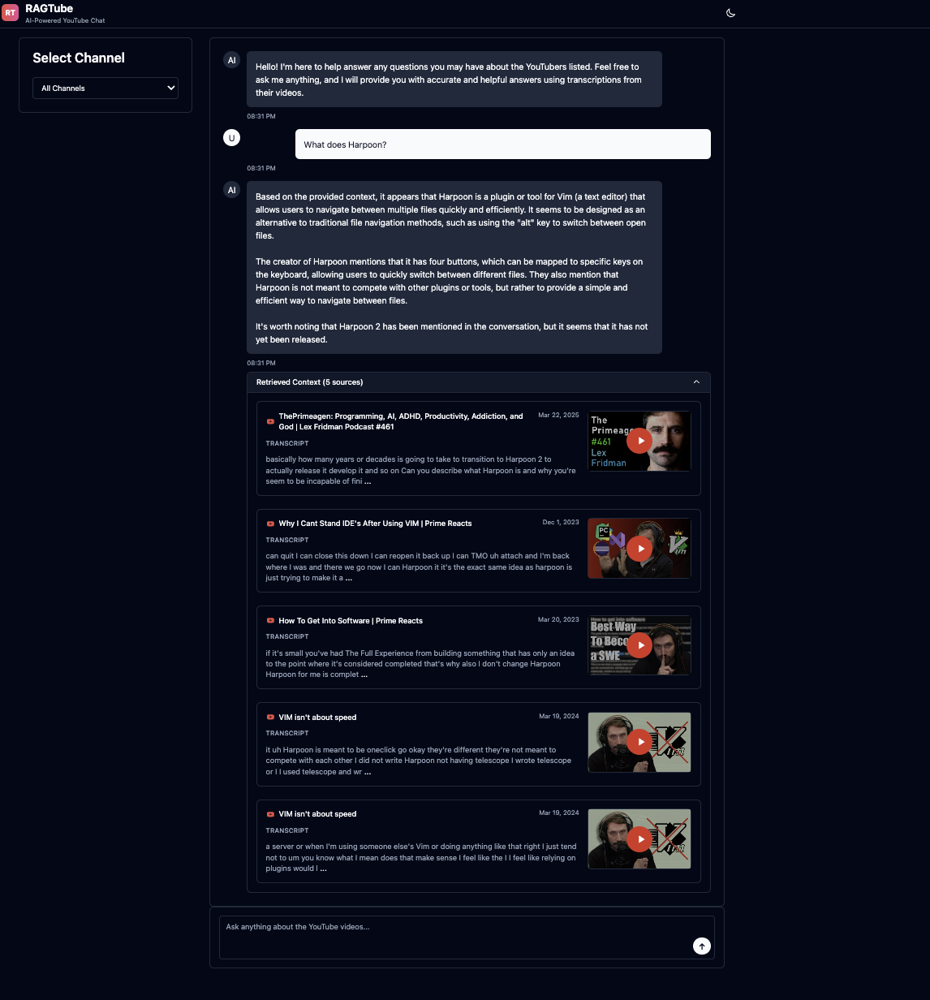
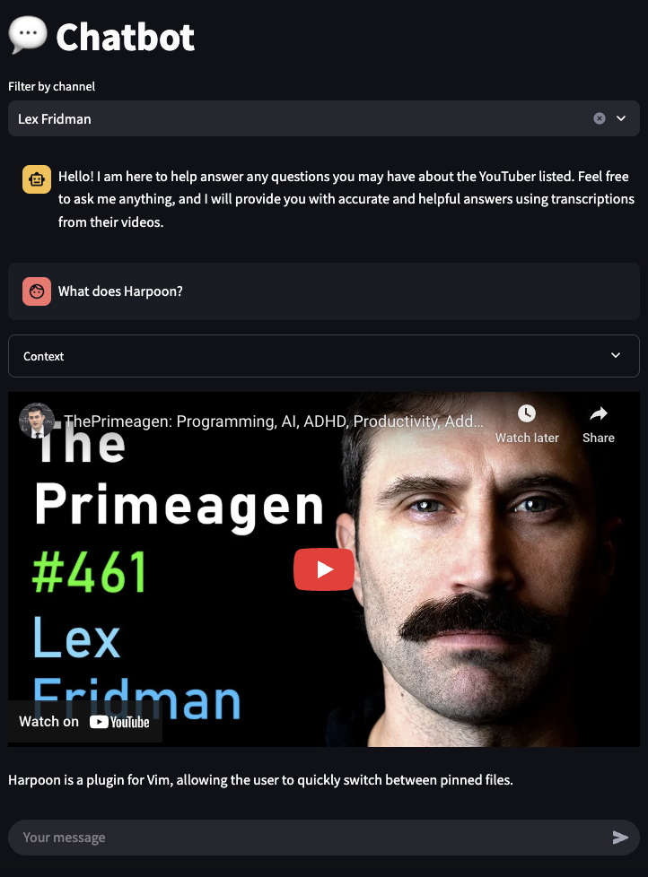
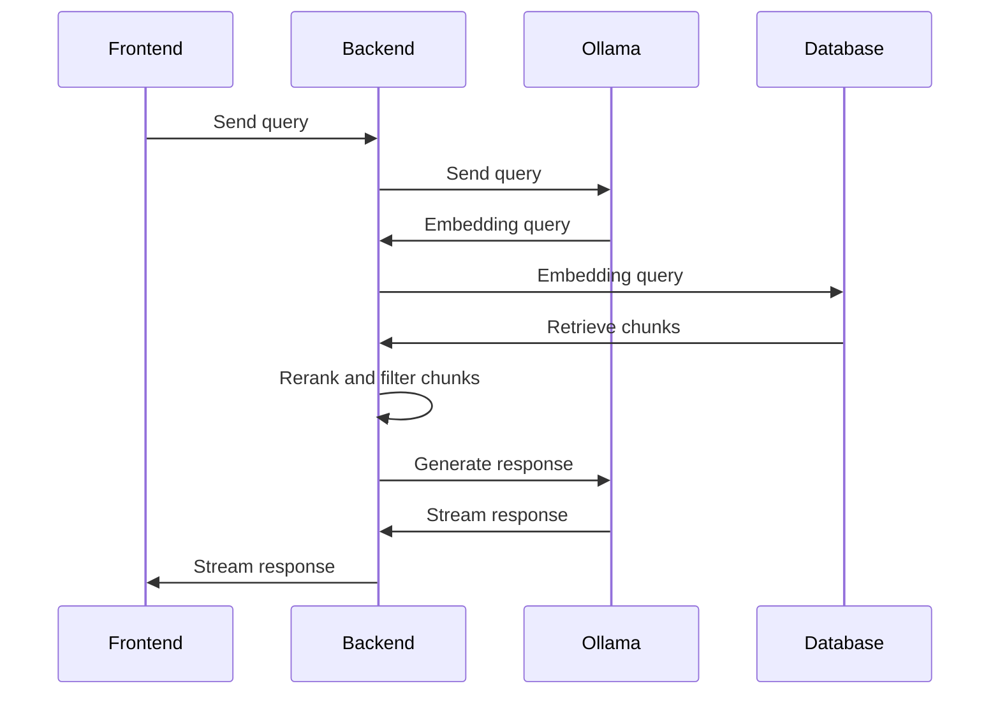

# RAGTube

RAGTube is a Retrieval Augmented Generation (RAG) application that lets you query transcriptions from your favorite YouTubers. It retrieves the most relevant transcription chunks for your query and provides them as context to a large language model (LLM) to generate responses.

> **✨ New!** RAGTube now features a modern **shadcn/ui frontend** alongside the original Streamlit interface. The new frontend offers enhanced UX with real-time chat, YouTube video embedding, and beautiful responsive design.

🌐 **Live Demo:** https://ragtube.dgarridoa.xyz/
📖 **Frontend Documentation:** [frontend/README.md](frontend/README.md)

**Modern shadcn/ui Interface (Recommended):**


**Legacy Streamlit Interface:**



# Arquitecture

• Database & Vector Storage: A PostgreSQL database is employed to persist data including channels, videos, transcriptions, and chunks. It utilizes the pgvector extension to enable vector similarity search, enabling exact and approximate nearest neighbgor search. To interact with the database the SQLModel ORM is used.

• Ollama: To serve a local embedding and language model. It generates embeddings for text (transcriptions chunks and queries) and for generating responses based on the query and its corresponding contextual information provided by the retriever.

• Backend: Built using FastAPI, the backend layer exposes endpoints for readiness checks, listing channels, and handling RAG queries. This API communicates with both the database (to fetch data), and Ollama (to generate embeddings and chat completions). The RAG endpoint retrieves the most relevant chunks, reranks them using FlashRank and filters them, and finally passes them to the chat model to generate responses.

• Frontend: RAGTube offers two user interface options:
  - **[Modern Frontend (Recommended)](frontend/README.md)**: A beautiful, responsive interface built with **shadcn/ui**, **Vite**, and **Vanilla JavaScript**. Features real-time chat, YouTube video embedding, dark/light themes, and modern UX patterns.
  - **Legacy Frontend**: A Streamlit-based interface (maintained for compatibility).

  The shadcn/ui frontend provides a superior user experience and is the recommended choice.

• CLI and Database Tools: A Typer-based command line interface is provided for database population. It downloads transcriptions, split them into chunks, computes their embeddings and create the HNSW index if does not exist.

• Containerization & Deployment: Docker Compose is used to orchestrate the entire application stack including the PostgreSQL database, Ollama (for model serving), FastAPI (backend), modern shadcn/ui frontend, and additional services such as Watchtower for automated rolling releases and Traefik as a reverse proxy with SSL handling.



# Backend

A high-performance FastAPI service that powers retrieval and streaming chat.

**Features:**
- 🚦 Readiness probe at `/readiness`
- 📚 Channel listing via `/channel`
- 🔎 Vector retrieval (pgvector + HNSW) with optional `channel_id`
- 🧠 Ollama integration for embeddings and chat
- 📡 Streaming NDJSON responses from `/rag`
- ⚙️ Config via root `params.yaml` and `.env`

**Quick Start:**
```bash
cd backend
uv sync --alll-extras
uv run uvicorn ragtube.api:app --host 0.0.0.0 --port 5000 --log-config log_config.yaml
```

Access at [http://localhost:5000](http://localhost:5000) · Docs at [http://localhost:5000/docs](http://localhost:5000/docs)

📖 **[Complete Backend Documentation](backend/README.md)**

# Frontend

RAGTube provides two frontend options:

## Modern Frontend (Recommended) 🚀

A beautiful, responsive interface built with **shadcn/ui** and modern web technologies.

**Features:**
- 🎨 Beautiful shadcn/ui design system
- 💬 Real-time chat with streaming responses
- 📺 Embedded YouTube video player
- 🌙 Dark/light theme support
- 📱 Fully responsive design
- ⚡ Fast Vite development server

**Quick Start:**
```bash
cd frontend
npm install
npm run dev
```

Access at [http://localhost:8501](http://localhost:8501)

📖 **[Complete Frontend Documentation](frontend/README.md)**

## Legacy Frontend (Streamlit)

For compatibility, the original Streamlit interface is still available:

```bash
uv run python -m streamlit run ragtube/ui.py
```

Access at [http://localhost:8501](http://localhost:8501)

# CI/CD

The pull request will trigger the pipeline detailed in the `.github/workflows/onpr.yaml` file. The pipeline includes:

**Backend Testing:**
- PostgreSQL container setup
- Python 3.11 environment with uv
- Pre-commit hooks validation
- Unit tests with coverage reports

**Frontend Testing:**
- Node.js 18 environment setup
- NPM dependency installation
- Code formatting validation (Prettier)

**Docker Image Building:**
- Multi-platform builds (AMD64 + ARM64)
- Three Docker images: `ragtube`, `ollama`, and `ragtube-frontend`
- Automatic tagging with commit SHA
- Publishing to Docker Hub and GitHub Container Registry

As prerequisites, you should have the following [Github Secrets](https://docs.github.com/en/actions/security-for-github-actions/security-guides/using-secrets-in-github-actions) set up in your repository:
- `YOUTUBE_API_KEY`
- `HTTPS_PROXY`
- `DOCKER_HUB_PASSWORD`

, and set the `DOCKER_HUB_USERNAME` repository variable.

Docker images:
- https://hub.docker.com/repository/docker/dgarridoa/ragtube/general (Backend)
- https://hub.docker.com/repository/docker/dgarridoa/ragtube-frontend/general (Frontend)
- https://hub.docker.com/repository/docker/dgarridoa/ollama/general (Ollama)

# Rolling Release

Watchtower is used to automatically update the Docker containers when a new image is available. It is setup in the `docker-compose.yaml` file. When the CI/CD completes, containers using the `ragtube`, `ragtube-frontend`, and `ollama` images are automatically updated.

# Ingress

Cloudflare Tunnel is used to route traffic from a hostname to a local machine without exposing the public IP. First, install the Cloudflare CLI from [Cloudflare CLI](https://github.com/cloudflare/cloudflared) and create a tunnel. Then, assign a hostname to the tunnel and run it. For example:

```bash
brew install cloudflare/cloudflare/cloudflared
cloudflared tunnel create <tunnel-name>
cloudflared tunnel route dns <tunnel-name> <hostname>
cloudflared tunnel run <tunnel-name>
```

Set up the ingress in the `~/.cloudflared/config.yml` file as shown below:

```yaml
tunnel: <tunnel-id>
credentials-file: ~/.cloudflared/<tunnel-id>.json
ingress:
  - hostname: <hostname>
    service: http://localhost:8501
  - service: http_status:404
```

# Reverse Proxy and SSL

Traefik is used as a reverse proxy and to manage SSL certificates. It is setup in the `docker-compose.yaml` file. It listens to the ports 80 and 443 and routes the requests to the `ui` container. The SSL certificates are automatically generated by Let's Encrypt, with Cloudflare serving as the certificate resolver.

The specific traefik configuration is in the `traefik.yaml` file. The `TRAEFIK_CERTIFICATESRESOLVERS_CLOUDFLARE_ACME_EMAIL` (your email), `CF_DNS_API_TOKEN` (your Cloudflare API Token), and `HOSTNAME` (your hostname) environment variables must be added to the `.env` file.

References:
- [Traefik Let's Encrypt](https://doc.traefik.io/traefik/https/acme/)
- [Traefik environment variables](https://doc.traefik.io/traefik/reference/static-configuration/env/)
- [Create Cloudflare API token](https://developers.cloudflare.com/fundamentals/api/get-started/create-token/)

# Orchestration

Run the following command to start the services:

```bash
docker compose up
```
It will start the following containers
- `traefik`: reverse proxy.
- `watchtower`: rolling release.
- `ragtube-db`: database.
- `ragtube-db-init`: populate the database and then stop.
- `ragtube-api`: backend.
- `ragtube-ui`: frontent.

# Running Ollama on MAC with GPU support

Docker does not support the Metal API, but Ollama supports GPU acceleration on macOS. To use Ollama with GPU acceleration, run it natively by following the instructions in the Ollama section. Then, execute the following command.

```bash
docker compose -f docker-compose-mac.yaml up
```
